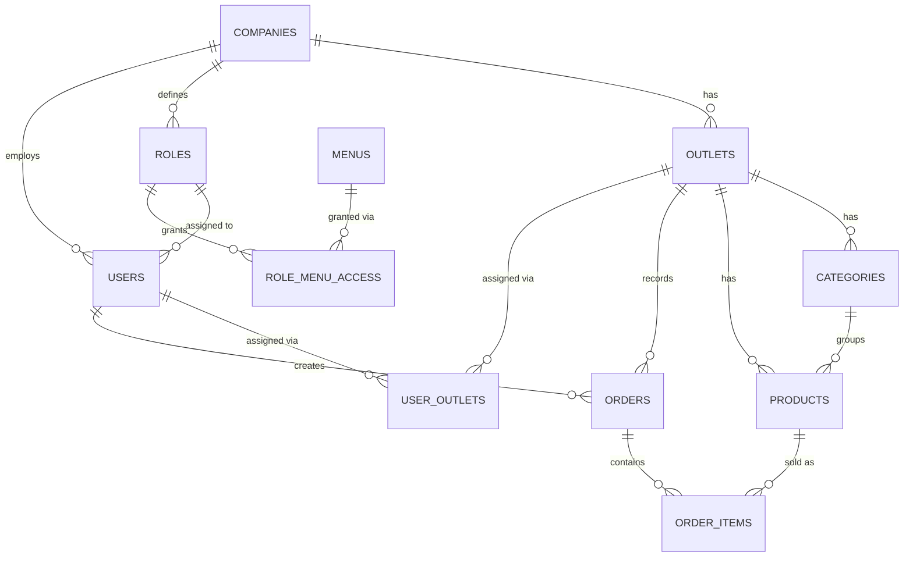
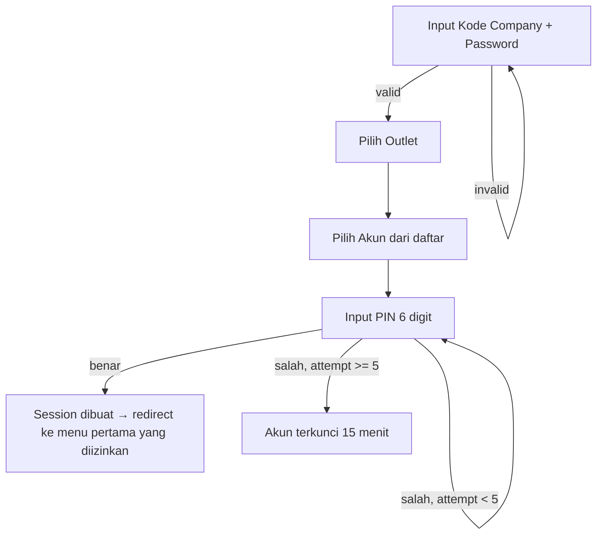

# Stocko — Multi-Tenant & RBAC Expansion (PRD v2)

> **Melanjutkan dari:** `AGENTS.md` (v1 — MVP single-tenant, sudah live & berjalan)
> **Stack:** Next.js 14 (App Router) · Supabase (Postgres + Storage) · Tailwind CSS
> **Versi:** 2.1 — Multi-Tenant & Access Control ✅ (Terealisasi)
> **Author:** Alif Dhimas
> **Tanggal:** Juni 2026

Legend status milestone: ⬜ Belum mulai · 🔄 Sedang dikerjakan · ✅ Selesai

---

## Daftar Isi

1. [Ringkasan Perubahan dari v1](#1-ringkasan-perubahan-dari-v1)
2. [Aktor & Functional Requirements](#2-aktor--functional-requirements)
3. [Non-Functional Requirements Tambahan](#3-non-functional-requirements-tambahan)
4. [Model Data & Skema Database](#4-model-data--skema-database)
5. [ERD](#5-erd)
6. [Alur Autentikasi](#6-alur-autentikasi)
7. [Role & Menu Access Control](#7-role--menu-access-control)
8. [Tech Stack & Struktur Folder (Update)](#8-tech-stack--struktur-folder-update)
9. [Roadmap & Milestone](#9-roadmap--milestone)
10. [Open Questions / Keputusan yang Perlu Divalidasi](#10-open-questions--keputusan-yang-perlu-divalidasi)

---

## 1. Ringkasan Perubahan dari v1

| Aspek | v1 | v2 (sekarang) |
|---|---|---|
| Tenancy | Single tenant (1 toko) | Multi-tenant — banyak **Company**, tiap company banyak **Outlet** ✅ |
| Auth | Supabase Auth (email + password) | Custom 4-step: **Company → Outlet → Akun → PIN**. Supabase Auth tetap dipakai khusus untuk Superadmin ✅ |
| Role & Akses | Implisit, hardcode (`admin`/`kasir`) | Dinamis — dikontrol Superadmin lewat **Role & Menu Access Matrix**, custom per company ✅ |
| Katalog Produk | Global, 1 toko | **Per outlet** — tiap outlet bisa punya kategori & produk berbeda ✅ |
| Transaksi (orders) | Tanpa scope tenant | Discope ke `company_id` + `outlet_id` + `cashier_id` ✅ |
| Pengelola sistem | Tidak ada peran terpisah | **Superadmin** (pemilik sistem) — kelola Company, Outlet, Menu, Role, Access, User ✅ |

---

## 2. Aktor & Functional Requirements

### 2.1 Aktor Sistem (update)

| Aktor | Deskripsi |
|---|---|
| **Superadmin** | Pemilik sistem (Alif). Mengatur Company, Outlet, Menu, Role, dan Access Matrix di seluruh tenant |
| **Owner** | Pemilik company, biasanya `all_outlets = true`, akses menyesuaikan apa yang diberikan Superadmin |
| **Kepala Cabang** | Mengelola 1 outlet tertentu |
| **Admin** | Operasional harian per outlet (mis. kelola produk, lihat laporan) |
| **Kasir** | Membuat & memproses pesanan di register |

### 2.2 Functional Requirements Baru

> Lanjutan numbering dari v1 (FR-01 s.d. FR-06 di `AGENTS.md`)

**FR-07 · Manajemen Company (Superadmin)**
- Superadmin dapat membuat, mengedit, menonaktifkan company
- Tiap company punya kode unik (untuk login) + password company
- Saat company dibuat, sistem otomatis seed 4 role default: Owner, Kepala Cabang, Admin, Kasir

**FR-08 · Manajemen Outlet**
- Superadmin dapat menambah/mengedit outlet dalam sebuah company
- Tiap outlet memiliki katalog produk sendiri (lihat FR-15)

**FR-09 · Manajemen Menu (Superadmin)**
- Superadmin dapat CRUD menu yang tersedia di sistem (register, orders, reports, products, dst.)
- Tiap menu memiliki slug, nama, icon, path, sort order

**FR-10 · Manajemen Role per Company (Superadmin)**
- Superadmin dapat CRUD role dalam sebuah company
- Role bersifat custom per company (tidak harus identik antar company)

**FR-11 · Role-Menu Access Matrix (Superadmin)**
- Superadmin mengatur menu apa saja yang bisa diakses tiap role, per company
- Ditampilkan sebagai matrix: baris = role, kolom = menu, toggle akses per sel

**FR-12 · Manajemen User/Akun**
- Superadmin dapat menambah akun karyawan dalam company: nama, username, role, outlet, PIN awal
- Owner ditandai `all_outlets = true` agar muncul di semua outlet saat pemilihan akun

**FR-13 · Autentikasi Multi-Step**
- Login: kode company + password company → pilih outlet → pilih akun → input PIN 6 digit
- Setelah PIN benar, sistem menampilkan menu sesuai akses role tersebut

**FR-14 · Dynamic Navigation**
- Sidebar/menu yang ditampilkan mengikuti hasil `role_menu_access`, bukan hardcode

**FR-15 · Katalog Produk per Outlet**
- `products` dan `categories` di-scope ke `outlet_id` (bukan company-wide)
- Tiap outlet bisa punya kategori & produk yang berbeda dari outlet lain dalam company yang sama

---

## 3. Non-Functional Requirements Tambahan

| NFR | Deskripsi | Status |
|---|---|---|
| **Keamanan PIN** | PIN 6 digit di-hash (bcrypt). Lockout otomatis setelah 5x gagal berturut-turut (15 menit) | ✅ |
| **Keamanan Password Company** | Di-hash (bcrypt). Rate-limit percobaan login per kode company (10 percobaan = lock 15 menit) | ✅ (M6) |
| **Isolasi Data** | Setiap query difilter `company_id`/`outlet_id` dari session — tidak ada jalur data bocor antar company | ✅ |
| **Audit** | Percobaan login (sukses/gagal) tercatat: waktu, company, outlet, akun, IP, user agent | ✅ (M6) |
| **Session** | `pending_login` expire 10 menit. `session` expire 12 jam (1 shift kerja). **Idle timeout 30 menit** | ✅ (M6) |

---

## 4. Model Data & Skema Database

### 4.1 Tabel Baru

```sql
-- =========================================================
-- TENANT CORE
-- =========================================================
CREATE TABLE companies (
  id            uuid PRIMARY KEY DEFAULT gen_random_uuid(),
  code          text UNIQUE NOT NULL,        -- kode login, misal "KOPIKITA"
  name          text NOT NULL,
  password_hash text NOT NULL,               -- bcrypt
  logo_url      text,
  status        text CHECK (status IN ('active','suspended')) DEFAULT 'active',
  created_at    timestamptz DEFAULT now()
);

CREATE TABLE outlets (
  id         uuid PRIMARY KEY DEFAULT gen_random_uuid(),
  company_id uuid NOT NULL REFERENCES companies(id) ON DELETE CASCADE,
  name       text NOT NULL,
  address    text,
  status     text CHECK (status IN ('active','inactive')) DEFAULT 'active',
  created_at timestamptz DEFAULT now(),
  UNIQUE (company_id, name)
);

-- =========================================================
-- ROLE & MENU ACCESS (dikontrol Superadmin)
-- =========================================================
CREATE TABLE menus (
  id         uuid PRIMARY KEY DEFAULT gen_random_uuid(),
  slug       text UNIQUE NOT NULL,   -- 'register' | 'orders' | 'reports' | 'products'
  name       text NOT NULL,
  icon       text,
  path       text NOT NULL,          -- '/register'
  sort_order int DEFAULT 0
);

CREATE TABLE roles (
  id         uuid PRIMARY KEY DEFAULT gen_random_uuid(),
  company_id uuid NOT NULL REFERENCES companies(id) ON DELETE CASCADE,
  name       text NOT NULL,          -- 'Owner' | 'Kepala Cabang' | 'Admin' | 'Kasir'
  UNIQUE (company_id, name)
);

CREATE TABLE role_menu_access (
  role_id    uuid NOT NULL REFERENCES roles(id) ON DELETE CASCADE,
  menu_id    uuid NOT NULL REFERENCES menus(id) ON DELETE CASCADE,
  can_view   boolean DEFAULT true,   -- MVP: cukup ini dulu
  can_create boolean DEFAULT false,  -- granularitas aksi, opsional fase 2
  can_edit   boolean DEFAULT false,
  can_delete boolean DEFAULT false,
  PRIMARY KEY (role_id, menu_id)
);

-- =========================================================
-- USER / AKUN (pengganti Supabase Auth utk sisi tenant)
-- =========================================================
CREATE TABLE users (
  id                  uuid PRIMARY KEY DEFAULT gen_random_uuid(),
  company_id          uuid NOT NULL REFERENCES companies(id) ON DELETE CASCADE,
  role_id             uuid NOT NULL REFERENCES roles(id),
  name                text NOT NULL,
  username            text NOT NULL,         -- tampil di layar pilih akun
  pin_hash            text NOT NULL,         -- bcrypt dari PIN 6 digit
  avatar_url          text,
  all_outlets         boolean DEFAULT false, -- true khusus Owner
  status              text CHECK (status IN ('active','inactive')) DEFAULT 'active',
  failed_pin_attempts int DEFAULT 0,
  locked_until        timestamptz,
  created_at          timestamptz DEFAULT now(),
  UNIQUE (company_id, username)
);

CREATE TABLE user_outlets (
  user_id   uuid NOT NULL REFERENCES users(id) ON DELETE CASCADE,
  outlet_id uuid NOT NULL REFERENCES outlets(id) ON DELETE CASCADE,
  PRIMARY KEY (user_id, outlet_id)
);
```

### 4.2 Tabel Existing — Diubah Jadi Per-Outlet

> **Catatan:** Tables `categories`, `products`, `modifiers`, `orders`, `order_items` sudah ada dari v1 (`001_init.sql`). Migration `002_multi_tenant.sql` menambahkan kolom tenant dengan `ALTER TABLE`, bukan `CREATE TABLE`.

```sql
-- categories: tambah scope tenant (ALTER, karena tabel sudah ada)
ALTER TABLE categories
  ADD COLUMN company_id uuid REFERENCES companies(id) ON DELETE CASCADE,
  ADD COLUMN outlet_id  uuid REFERENCES outlets(id) ON DELETE CASCADE;

-- products: tambah scope tenant
ALTER TABLE products
  ADD COLUMN company_id uuid REFERENCES companies(id) ON DELETE CASCADE,
  ADD COLUMN outlet_id  uuid REFERENCES outlets(id) ON DELETE CASCADE;

-- orders: tambah kolom scope tenant + cashier
ALTER TABLE orders
  ADD COLUMN company_id uuid REFERENCES companies(id),
  ADD COLUMN outlet_id  uuid REFERENCES outlets(id),
  ADD COLUMN cashier_id uuid REFERENCES users(id);

-- modifiers: scope tetap ikut product_id (tidak berubah)
-- order_items: scope tetap ikut order_id (tidak berubah)
```

### 4.3 Migration Tambahan

```sql
-- 003_rls_permissive.sql: Non-aktifkan RLS pada tabel produk & orders
-- karena auth ditangani app-level (JWT session), bukan Supabase Auth.
ALTER TABLE categories DISABLE ROW LEVEL SECURITY;
ALTER TABLE products   DISABLE ROW LEVEL SECURITY;
ALTER TABLE modifiers  DISABLE ROW LEVEL SECURITY;
ALTER TABLE orders     DISABLE ROW LEVEL SECURITY;
ALTER TABLE order_items DISABLE ROW LEVEL SECURITY;
```

### 4.4 Index Tambahan

```sql
CREATE INDEX idx_categories_outlet ON categories(outlet_id);
CREATE INDEX idx_products_outlet   ON products(outlet_id);
CREATE INDEX idx_orders_outlet     ON orders(outlet_id);
CREATE INDEX idx_orders_company    ON orders(company_id);
CREATE INDEX idx_users_company     ON users(company_id);
CREATE INDEX idx_roles_company     ON roles(company_id);
```

---

## 5. ERD



---

## 6. Alur Autentikasi

Karena 3 langkah pertama belum jadi identitas user yang terverifikasi, dipakai cookie sementara `pending_login` (signed JWT, expire ±10 menit) yang isinya bertambah tiap step. Setelah PIN benar, cookie ini dibuang dan diganti cookie `session` final.



**Detail per step:**

1. **Company login** — `POST /auth/company` → cek `companies.password_hash` → set cookie `pending_login = { company_id }`
2. **Pilih outlet** — fetch outlet aktif milik `company_id` → `POST /auth/outlet` → validasi outlet memang milik company tersebut → update cookie `{ company_id, outlet_id }`
3. **Pilih akun** — fetch `users` WHERE `company_id` cocok DAN (`all_outlets = true` ATAU ada baris di `user_outlets` untuk outlet terpilih) DAN `status = 'active'` → tampilkan nama + avatar saja
4. **Input PIN** — `POST /auth/verify-pin` → cek `locked_until` & `pin_hash` → salah: increment `failed_pin_attempts`, lock setelah 5x → benar: reset counter, hapus `pending_login`, set cookie `session = { user_id, company_id, outlet_id, role_id }`, redirect ke menu pertama yang diizinkan

**Superadmin** tetap login lewat Supabase Auth (email/password) terpisah dari alur ini.

---

## 7. Role & Menu Access Control

- `menus` = daftar modul global yang tersedia di sistem (dikelola Superadmin). Seed default: `register`, `orders`, `reports`, `products`.
- `roles` = di-scope per company → tiap company punya daftar role sendiri. Seed default: Owner, Kepala Cabang, Admin, Kasir.
- `role_menu_access` = matrix akses: baris role, kolom menu. Saat ini hanya `can_view` dipakai di UI; kolom `can_create`, `can_edit`, `can_delete` sudah ada di skema untuk fase depan.
- Implementasi: `getAllowedMenus(roleId)` di `src/lib/auth/menus.ts` query `role_menu_access` JOIN `menus`, filter `can_view = true`, urut `sort_order`.

Contoh matrix default yang di-seed untuk 1 company:

| Role | Register | Orders | Reports | Products |
|---|---|---|---|---|
| Owner | ✅ | ✅ | ✅ | ✅ |
| Kepala Cabang | ✅ | ✅ | ✅ | ⬜ |
| Admin | ⬜ | ✅ | ✅ | ✅ |
| Kasir | ✅ | ✅ | ⬜ | ⬜ |

Sidebar (`src/components/layout/Sidebar.tsx`) = hasil query `role_menu_access` 100% dinamis — bukan hardcode.

---

## 8. Tech Stack & Struktur Folder (Update)

| Layer | Implementasi |
|---|---|
| Auth tenant | Custom — `jose` sign/verify JWT cookie, `bcryptjs` hash password & PIN ✅ |
| Auth superadmin | Supabase Auth (email/password) ✅ |
| Authorization | App-level: helper `getAllowedMenus(roleId)`, setiap query filter `company_id` + `outlet_id` dari session (RLS dinonaktifkan di migration 003) ✅ |
| State management | Zustand (`cartStore`) ✅ |
| UI icons | lucide-react ✅ |
| Storage | Supabase Storage untuk upload gambar produk ✅ |

### Struktur Folder Aktual

```
app/
├── (auth)/                        ← Tenant auth route group
│   └── login/
│       ├── page.tsx               ← Step 1: kode company + password
│       ├── select-outlet/
│       │   └── page.tsx           ← Step 2: pilih outlet
│       ├── select-user/
│       │   └── page.tsx           ← Step 3: pilih akun
│       └── enter-pin/
│           └── page.tsx           ← Step 4: input PIN 6 digit
├── (dashboard)/                   ← Tenant dashboard (dibungkus middleware access-check)
│   ├── layout.tsx                 ← Sidebar + mobile nav + guard akses menu
│   ├── error.tsx
│   ├── register/
│   │   ├── page.tsx               ← POS Register
│   │   └── loading.tsx
│   ├── orders/
│   │   ├── page.tsx               ← Daftar pesanan
│   │   └── loading.tsx
│   ├── reports/
│   │   ├── page.tsx               ← Laporan penjualan + grafik
│   │   └── loading.tsx
│   └── admin/
│       ├── products/
│       │   ├── page.tsx           ← CRUD produk per outlet
│       │   ├── AdminProductsClient.tsx
│       │   └── loading.tsx
│       └── categories/
│           ├── page.tsx           ← CRUD kategori per outlet
│           ├── AdminCategoriesClient.tsx
│           └── loading.tsx
├── superadmin/                    ← Panel superadmin (route not grouped)
│   ├── login/
│   │   └── page.tsx               ← Supabase Auth login
│   ├── (protected)/
│   │   ├── layout.tsx             ← Superadmin sidebar nav
│   │   ├── companies/
│   │   │   └── page.tsx           ← CRUD companies
│   │   ├── outlets/
│   │   │   └── page.tsx           ← CRUD outlets per company
│   │   ├── menus/
│   │   │   └── page.tsx           ← CRUD menus
│   │   ├── roles/
│   │   │   └── page.tsx           ← CRUD roles per company
│   │   ├── access-matrix/
│   │   │   └── page.tsx           ← Matrix role × menu (toggle can_view)
│   │   └── users/
│   │       └── page.tsx           ← CRUD users per company
│   └── ...                        ← (rute non-protected jika ada)
├── api/                           ← Backend API routes (serverless functions)
│   ├── auth/
│   │   └── tenant/
│   │       ├── company/route.ts   ← POST: verify company code + password
│   │       ├── outlet/route.ts    ← GET: list outlets; POST: select outlet
│   │       ├── accounts/route.ts  ← GET: list akun untuk outlet terpilih
│   │       ├── verify-pin/route.ts← POST: verify PIN + lockout + create session
│   │       ├── session/route.ts   ← GET: baca session saat ini
│   │       └── logout/route.ts    ← POST: clear cookies
│   ├── admin/
│   │   ├── products/route.ts      ← POST, PATCH, PUT
│   │   ├── categories/route.ts    ← POST, PATCH, DELETE
│   │   ├── modifiers/route.ts     ← GET, POST, DELETE
│   │   └── orders/route.ts        ← POST: create order
│   └── superadmin/
│       ├── companies/route.ts     ← GET, POST, PUT
│       ├── outlets/route.ts       ← GET, POST, PUT
│       ├── menus/route.ts         ← GET, POST, PUT, DELETE
│       ├── roles/route.ts         ← GET, POST, PUT, DELETE
│       ├── users/route.ts         ← GET, POST, PUT
│       └── access-matrix/route.ts ← GET, POST (toggle)
├── error.tsx                      ← Root error boundary
├── globals.css
├── layout.tsx                     ← Root layout
└── page.tsx                       ← Redirect ke /login

lib/
├── auth/
│   ├── tenant-session.ts          ← sign/verify JWT session (exp: 12 jam)
│   ├── pending-login.ts           ← sign/verify JWT pending (exp: 10 menit)
│   ├── pin.ts                     ← hash/verify PIN + lockout config
│   ├── company.ts                 ← verifyCompanyLogin, getActiveOutlets, getAccountsForOutlet
│   ├── menus.ts                   ← getAllowedMenus(roleId), getAllMenus
│   └── superadmin.ts              ← requireSuperadmin() guard
├── supabase/
│   ├── admin.ts                   ← createAdminClient (service role key)
│   ├── client.ts                  ← createClient (browser - anon key)
│   ├── server.ts                  ← createServerClient (server component)
│   ├── queries.client.ts          ← Client-side API wrappers (order, CRUD)
│   ├── queries.server.ts          ← Server queries with tenant scope
│   ├── queries.superadmin.ts      ← Superadmin CRUD queries
│   └── storage.ts                 ← Upload/delete product images
├── store/
│   └── cartStore.ts               ← Zustand store (cart, order type, totals)
├── dummy-data.ts                  ← Sample data untuk dev/testing
└── types/                         ← (dirujuk ke src/types/)

src/
├── components/
│   ├── layout/
│   │   ├── Sidebar.tsx            ← Sidebar dinamis berdasarkan role
│   │   └── MobileBottomNav.tsx    ← Mobile bottom navigation
│   ├── register/
│   │   ├── RegisterView.tsx       ← Main register (search, grid, cart, payment)
│   │   ├── ProductGrid.tsx        ← Product card grid
│   │   ├── ProductCard.tsx        ← Product card (image, name, price)
│   │   ├── CategoryTabs.tsx       ← Category filter tabs
│   │   ├── OrderSidebar.tsx       ← Cart drawer (desktop + mobile)
│   │   ├── MobileCartBar.tsx      ← Floating cart bar (mobile)
│   │   └── PaymentModal.tsx       ← Payment modal (cash/card/QRIS)
│   └── shared/
│       ├── Badge.tsx              ← Status badge
│       ├── EmptyState.tsx         ← Empty state placeholder
│       ├── QtyControl.tsx         ← Quantity increment/decrement
│       └── Toast.tsx              ← Toast notification
├── hooks/
│   ├── useMediaQuery.ts           ← Responsive breakpoints (isMobile, isTablet, isDesktop)
│   └── useSwipe.ts                ← Touch swipe gesture
└── types/
    └── index.ts                   ← All TypeScript interfaces

middleware.ts                      ← Route protection: tenant session + superadmin auth
```

---

## 9. Roadmap & Milestone

| Milestone | Tujuan | Status |
|---|---|---|
| M0 — Schema Multi-Tenant | Tabel baru dibuat, belum mengubah behavior existing | ✅ Selesai |
| M1 — Migrasi Data Existing | Data v1 dipetakan ke 1 company + 1 outlet default | ✅ Selesai |
| M2 — Alur Login Baru | Company → Outlet → Akun → PIN menggantikan login lama | ✅ Selesai |
| M3 — Authorization Middleware | Semua halaman & query tunduk pada role_menu_access | ✅ Selesai |
| M4 — Panel Superadmin | CRUD Company/Outlet/Menu/Role/Access/User dari UI | ✅ Selesai |
| M5 — QA & Onboarding Company Kedua | Validasi isolasi data antar tenant benar-benar jalan | ✅ Selesai |
| M6 — Polish & Hardening | Lockout, audit log, session expiry, opsional RLS | ✅ Selesai |

### M0 — Schema Multi-Tenant ✅
- [x] Migration `002_multi_tenant.sql`: `companies`, `outlets`, `roles`, `menus`, `role_menu_access`, `users`, `user_outlets`
- [x] `ALTER TABLE` untuk `categories` & `products` — tambah `company_id` + `outlet_id`
- [x] `ALTER TABLE orders` — tambah `company_id`, `outlet_id`, `cashier_id`
- [x] Index tambahan (lihat 4.4)
- [x] Seed 4 menu default: register, orders, reports, products
- [x] Migration `003_rls_permissive.sql`: disable RLS pada tabel produk/orders (app-level auth)

### M1 — Migrasi Data Existing → Tenant Default ✅
- [x] `seed.ts`: Insert 1 row `companies` (STOCKO) + 1 row `outlets` (Outlet Utama)
- [x] Insert 4 role default (Owner, Kepala Cabang, Admin, Kasir) untuk company default
- [x] Isi `role_menu_access`: Owner full akses, Kepala Cabang (register/orders/reports), Admin (orders/reports/products), Kasir (register/orders)
- [x] Migrasi user → tabel `users` (username + PIN hash bcrypt)
- [x] Backfill `company_id` + `outlet_id` ke seluruh data `categories`/`products`/`orders` existing

### M2 — Alur Login Baru ✅
- [x] API `POST /api/auth/tenant/company`: verify company code + password
- [x] API `GET /api/auth/tenant/outlet` + `POST`: list & pilih outlet
- [x] API `GET /api/auth/tenant/accounts`: list akun per outlet (handle `all_outlets`)
- [x] API `POST /api/auth/tenant/verify-pin`: verify PIN + lockout logic + create session
- [x] Cookie `pending_login` (signed JWT, 10 menit expiry)
- [x] Cookie `session` final (signed JWT, 12 jam expiry)
- [x] 4 halaman UI: `/login` → `/login/select-outlet` → `/login/select-user` → `/login/enter-pin`
- [x] Logout flow (clear cookies + redirect)
- [x] API `GET /api/auth/tenant/session`: baca session saat ini
- [x] Lockout: 5 failed PIN attempts → lock 15 menit

### M3 — Authorization Middleware & Menu Access ✅
- [x] `middleware.ts`: cek session valid di semua route dashboard, redirect ke `/login` jika invalid
- [x] Helper `getAllowedMenus(roleId)` di `lib/auth/menus.ts` — render sidebar dinamis
- [x] Dashboard layout guard: redirect/403 jika menu tidak diizinkan
- [x] Semua query di `queries.server.ts` filter `company_id` + `outlet_id` dari session

### M4 — Panel Superadmin ✅
- [x] Auth superadmin via Supabase Auth (`/superadmin/login`)
- [x] CRUD Companies (`/superadmin/(protected)/companies`)
- [x] CRUD Outlets per company (`/superadmin/(protected)/outlets`)
- [x] CRUD Menus (`/superadmin/(protected)/menus`)
- [x] CRUD Roles per company (`/superadmin/(protected)/roles`)
- [x] Access Matrix UI (role × menu toggle can_view) (`/superadmin/(protected)/access-matrix`)
- [x] CRUD Users per company (assign role + outlet + PIN) (`/superadmin/(protected)/users`)
- [x] API routes terpisah untuk setiap entitas (`/api/superadmin/*`)

### M5 — QA & Onboarding Company Kedua ✅
- [x] `seed-full.ts`: buat company TOKOKO + outlet Toko Utama + 3 user (Owner, Admin, Kasir)
- [x] Validasi data tidak tertukar: STOCKO punya kopi, TOKOKO punya nasi goreng — tidak saling terlihat
- [x] Validasi akses menu sesuai role (Owner full access, Kasir hanya register/orders)
- [x] STOCKO memiliki 2 outlet (Outlet Utama + Outlet Cabang) dengan katalog produk berbeda

### M6 — Polish & Hardening ✅
- [x] Rate-limit percobaan login password company (per kode company) - 10 percobaan = lock 15 menit
- [x] Audit log percobaan login (siapa, kapan, dari outlet mana, berhasil/gagal) - auth_audit_logs table
- [x] Session idle timeout (auto-logout setelah tidak aktif) - 30 menit idle timeout
- [x] Auto-refresh session activity - Client-side refresh setiap 5 menit
- [ ] (Opsional) RLS via Postgres session variable sebagai defense-in-depth

**Implementation Details:**
- Migration `004_m6_hardening.sql`: Menambahkan kolom rate limiting ke `companies` table dan membuat `auth_audit_logs` table
- `lib/auth/audit-log.ts`: Utility untuk mencatat event autentikasi
- `lib/auth/company.ts`: Rate limiting untuk company login (10 attempts = 15 min lock)
- `lib/auth/tenant-session.ts`: Idle timeout logic (30 menit) + refreshSessionActivity function
- `app/api/auth/tenant/refresh/route.ts`: API endpoint untuk refresh session activity
- `components/auth/SessionRefresher.tsx`: Client component yang auto-refresh session setiap 5 menit
- Audit logging di semua auth endpoints: company, outlet, accounts, verify-pin, logout
- IP address dan User Agent dicatat untuk setiap event autentikasi

---

## 10. Open Questions / Keputusan yang Perlu Divalidasi

| Pertanyaan | Keputusan Saat Ini | Catatan |
|---|---|---|
| **Penomoran order** — global atau reset per outlet? | **Global** (`serial` increment) via Supabase `created_at` + `id` sorting | Belum ada format nomor invoice eksplisit |
| **Laporan lintas outlet** — Owner lihat gabungan atau per outlet? | **Per outlet berdasarkan session** — Owner login ke outlet spesifik, lihat data outlet itu saja | `all_outlets` hanya untuk fleksibilitas login, laporan gabungan belum diimplementasi |
| **Pengelolaan role** — Superadmin saja atau Owner self-service? | **Superadmin saja** untuk fase ini. Owner company belum bisa kelola role sendiri | Bisa dibuka di versi berikutnya |
| **Custom menu per company** — menu tetap atau fleksibel? | **Menu tetap** (4 standar: register/orders/reports/products). Superadmin bisa tambah menu baru via panel | Menu baru otomatis tersedia di access matrix semua company |
| **RLS** — pakai Supabase RLS atau app-level? | **App-level** (service role key). RLS sengaja dinonaktifkan (lihat migration 003) | Lebih sederhana, isolasi dijamin oleh filter query manual |

---

*Dokumen ini adalah snapshot kondisi terkini setelah implementasi v2. Fitur v1 (register, orders, reports, products) tetap berjalan — sekarang dengan lapisan tenant, auth custom, dan access control dinamis di atasnya. Lihat `AGENTS.md` untuk panduan teknis dan konvensi kode.*

---

## 11. Enhanced POS Features (30 Juni 2026)

### Fitur yang Ditambahkan

1. **Create Product dengan Add-on** — Saat create produk baru, user bisa langsung menambahkan add-ons/modifiers tanpa perlu save dulu lalu edit
2. **Dynamic Pricing (Optional)** — Base price wajib, bisa tambah opsi harga lain seperti Gojek Regular/Express untuk fleksibilitas harga
3. **Bayar Nanti (Pay Later / Draft Orders)** — Simpan order sebagai draft dengan status `draft`, bayar kemudian. 24h auto-expiry
4. **Nama Customer Wajib** — Setiap order (langsung bayar atau paylater) wajib memiliki nama customer
5. **Order Summary Grouped by Category** — Tampilan cart dan payment summary dikelompokkan per kategori produk

### Skema Database Tambahan (`migration 006_pricing_draft.sql`)
- `pricing_options` table: opsi harga tambahan per produk (contoh: Gojek Regular, Gojek Express)
- `orders` table: tambah kolom `status` (draft/pending/completed/cancelled), `payment_status` (unpaid/partial/paid/refunded), `customer_name` (NOT NULL), `reserved_until`, `pricing_option_id`

### File Baru
- `src/app/api/admin/pricing-options/route.ts` — CRUD pricing options
- `src/app/api/admin/orders/draft/route.ts` — Draft order API (GET/POST/PATCH/DELETE)
- `src/components/admin/PricingOptionsManager.tsx` — Admin UI untuk manage pricing options
- `src/components/register/PricingOptionSelector.tsx` — Pilih opsi harga saat add product di register
- `src/components/register/DraftOrdersPanel.tsx` — Panel daftar draft orders
- `supabase/migrations/006_pricing_draft.sql` — Migration schema

### Status: ✅ Selesai (30 Juni 2026)

---

## 12. Enhanced POS Features — Phase 2 (1 Juli 2026)

### Ringkasan Fitur

| # | Fitur | Tipe | Kompleksitas |
|---|-------|------|:---:|
| F-01 | Bayar Nanti pindah ke sidebar (secondary button) | UX Fix | ⭐ |
| F-02 | Invoice + Print | Fitur Baru | ⭐⭐ |
| F-03 | Cashier Name tampil di Order | Fix | ⭐ |
| F-04 | Add-on "Other" (input manual) | Fitur Baru | ⭐⭐ |
| F-05 | Kirim Laporan ke Email | Fitur Baru | ⭐⭐ |
| F-06 | Urutan Current Order by Category | UX Fix | ⭐ |
| F-07 | Fix Merging Item + Add-on (sama/gabung, beda/pisah) | Bug Fix | ⭐ |
| F-08 | Draft Order — tambahan item tidak merge dengan existing | Fix | ⭐⭐ |
| F-09 | Edit Add-on Item yang sudah di Current Order | Fitur Baru | ⭐⭐⭐ |
| F-10 | Grouping visual + Breakdown Item (group per product) | Fitur Baru | ⭐⭐⭐ |
| F-11 | Order-level Pricing Types (Dine In / Take Away / Gojek) | Perubahan Besar | ⭐⭐⭐⭐⭐ |
| F-12 | Split Bill (pembayaran rombongan) | Fitur Baru | ⭐⭐⭐⭐ |

### Status Legend

⬜ Belum mulai · 🔄 Sedang dikerjakan · ✅ Selesai

---

### Milestone M7 — Cart & Order UX Fixes

| # | Task | Status |
|---|------|--------|
| 7.1 | **F-07**: Fix merging item dengan add-on sama/berbeda | ⬜ |
| 7.2 | **F-03**: Cashier name di order + migration + API | ⬜ |
| 7.3 | **F-06**: Urutan current order by category | ⬜ |
| 7.4 | **F-08**: Draft order append — item baru tidak merge dengan item draft existing | ⬜ |

### Milestone M8 — Payment & Cart Enhancement

| # | Task | Status |
|---|------|--------|
| 8.1 | **F-01**: Bayar nanti pindah ke sidebar (secondary button) | ⬜ |
| 8.2 | **F-09**: Edit add-on item di current order | ⬜ |
| 8.3 | **F-04**: Add-on "Other" input manual | ⬜ |
| 8.4 | **F-10**: Grouping visual + breakdown item detail modal | ⬜ |

### Milestone M9 — Invoice & Reporting

| # | Task | Status |
|---|------|--------|
| 9.1 | **F-02**: Invoice receipt + print (modal + halaman dedicated) | ⬜ |
| 9.2 | **F-05**: Kirim laporan ke email (Resend integration) | ⬜ |

### Milestone M10 — Advanced Features

| # | Task | Status |
|---|------|--------|
| 10.1 | **F-11**: Order-level pricing types (migration, UI, cart recalc) | ⬜ |
| 10.2 | **F-12**: Split bill (table, panel, payment flow) | ⬜ |

### Milestone M11 — Migration & Data Backfill

| # | Task | Status |
|---|------|--------|
| 11.1 | Migration `007_july_features.sql` | ⬜ |
| 11.2 | Backfill `cashier_name` untuk existing orders | ⬜ |
| 11.3 | Backfill `product_tier_prices` untuk produk existing | ⬜ |
| 11.4 | Update order_type constraint di existing orders | ⬜ |

### Detail Implementasi per Fitur

#### F-01 · Bayar Nanti Pindah ke Sidebar

**Problem:** Tombol "Bayar Nanti" ada di dalam PaymentModal sebagai metode pembayaran, user harus buka modal dulu baru bisa lihat opsi ini.

**Solusi:** Pindahkan tombol "Bayar Nanti" ke `OrderSidebar.tsx` sebagai tombol secondary di sebelah "Proceed to Payment". Klik langsung save sebagai draft tanpa melalui modal. Di PaymentModal hapus opsi `later` dari grid pembayaran.

**Perubahan file:**
- `src/components/register/OrderSidebar.tsx` — tambah tombol "Bayar Nanti" secondary
- `src/components/register/PaymentModal.tsx` — hapus opsi `later`
- `src/lib/store/cartStore.ts` — helper fungsi saveAsDraft

#### F-02 · Invoice + Print

**Problem:** Tidak ada receipt/invoice setelah transaksi. Pelanggan tidak bisa mendapatkan bukti pembayaran.

**Solusi:** Setelah payment sukses, tampilkan modal invoice dengan tombol "Print". Juga buat halaman `/orders/[id]/invoice` untuk print dari riwayat order. Gunakan `window.print()` + CSS `@media print`.

**Perubahan file:**
- `src/components/register/InvoiceReceipt.tsx` — komponen invoice
- `src/app/(dashboard)/orders/[id]/invoice/page.tsx` — halaman dedicated
- `src/components/register/PaymentModal.tsx` — success screen → invoice preview
- `src/app/(dashboard)/orders/OrdersClient.tsx` — tambah link/icon print

#### F-03 · Cashier Name di Order

**Problem:** `orders` punya `cashier_id` tapi tidak menyimpan nama cashier. Tidak tampil di UI orders list maupun invoice.

**Solusi:** Migration tambah kolom `cashier_name`. API order ambil `user_name` dari session. Tampilkan di orders list, invoice, dan order detail.

**Perubahan file:**
- `supabase/migrations/007_july_features.sql` — ALTER TABLE orders
- `src/app/api/admin/orders/route.ts` — baca session, simpan cashier_name
- `src/app/api/admin/orders/draft/route.ts` — sama
- `src/app/(dashboard)/orders/OrdersClient.tsx` — tampilkan nama kasir
- `src/types/index.ts` — tambah cashier_name ke Order type

#### F-04 · Add-on "Other" (Input Manual)

**Problem:** Add-on hanya dari predefined modifiers di database. Tidak ada cara untuk input add-on custom.

**Solusi:** Di modifier modal, tambah opsi "+ Tambahan Lain" di bagian bawah. Jika dipilih: muncul input Nama + Harga. Simpan sebagai item cart dengan modifier pseudo id `custom-{timestamp}`.

**Perubahan file:**
- `src/components/register/RegisterView.tsx` — tambah opsi "Other" di modal
- `src/lib/store/cartStore.ts` — handle custom modifier
- `src/types/index.ts` — flag `is_custom` optional

#### F-05 · Kirim Laporan ke Email

**Problem:** Laporan hanya bisa dilihat di web, tidak bisa dikirim ke email.

**Solusi:** Tombol "Kirim ke Email" di halaman Reports. Modal input email. API route generate HTML report dan kirim via Resend.

**Dependency baru:** `resend`

**Perubahan file:**
- `src/app/api/reports/send-email/route.ts` — API kirim email
- `src/components/reports/EmailReportModal.tsx` — modal input email
- `src/app/(dashboard)/reports/ReportsClient.tsx` — tambah tombol

#### F-06 · Urutan Current Order by Category

**Problem:** Kategori di grouped cart tidak terurut (bergantung urutan items array, bukan sort_order kategori).

**Solusi:** `useCartGroupedArray` diurutkan berdasarkan sort_order kategori (atau prioritas: Makanan > Minuman > Snack > Add-ons).

**Perubahan file:**
- `src/lib/store/cartStore.ts` — sorting categories in `useCartGroupedArray`

#### F-07 · Fix Merging Item dengan Add-on Sama/Berbeda

**Problem:** Perlu dipastikan: produk + add-on SAMA → merge quantity; produk + add-on BERBEDA → item terpisah. Juga handle custom modifier.

**Solusi:** Validasi logic `addProduct()` — match by `product.id + modifier.id + pricing_option_id`. Custom modifier dianggap ID unik (tidak di-merge dengan sesamanya).

**Perubahan file:**
- `src/lib/store/cartStore.ts` — tweak `addProduct` matching logic

#### F-08 · Draft Order — Tambahan Item Tidak Digabung

**Problem:** Saat buka draft lalu tambah item baru, item yang sama dengan item existing dari draft bisa ter-merge (qty bertambah), padahal seharusnya dibuat item baru terpisah.

**Solusi:** Setiap CartItem punya flag `source: 'draft' | 'new'`. Logika merge hanya untuk item dengan source yang sama.

**Perubahan file:**
- `src/lib/store/cartStore.ts` — tambah source di CartItem, modifikasi addProduct
- `src/components/register/DraftOrdersPanel.tsx` — set source='draft' saat restore
- `src/types/index.ts` — tambah `source` di CartItem

#### F-09 · Edit Add-on Item di Current Order

**Problem:** Item di cart tidak bisa diedit add-onsnya setelah ditambahkan, hanya bisa ubah qty atau hapus.

**Solusi:** Tombol edit (Pencil icon) di setiap cart item. Klik → buka modifier modal (reuse). Store: `updateItemModifier(itemId, newModifier)`.

**Perubahan file:**
- `src/lib/store/cartStore.ts` — tambah `updateItemModifier` action
- `src/components/register/OrderSidebar.tsx` — tambah icon edit
- `src/components/register/RegisterView.tsx` — handle edit vs add flow

#### F-10 · Grouping + Breakdown Item dengan Add-on Berbeda

**Problem:** Produk sama dengan add-on berbeda tampil sebagai item terpisah tanpa grouping visual. Tidak ada cara melihat breakdown detail per add-on.

**Solusi:** Grouping visual dalam 1 card/border di sidebar per produk. Klik card → buka ItemDetailModal yang menampilkan breakdown per add-on (jumlah, subtotal, notes).

**Perubahan file:**
- `src/components/register/ItemDetailModal.tsx` — modal detail breakdown
- `src/components/register/OrderSidebar.tsx` — render grouped items
- `src/lib/store/cartStore.ts` — helper `getGroupedByProduct()`

#### F-11 · Order-level Pricing Types

**Problem:** Pricing saat ini per-product (dipilih saat add to cart). Requirement: order type (Dine In / Take Away / Gojek) menentukan harga semua produk.

**Solusi:** Buat tabel `pricing_tiers` + `product_tier_prices`. Order type tabs di sidebar (Dine In | Take Away | Gojek | Grab). Ganti order type → semua price di cart recalculate otomatis.

**Migration:**
- Tabel `pricing_tiers`: `(company_id, outlet_id, name, slug, is_active, sort_order)`
- Tabel `product_tier_prices`: `(product_id, tier_id, price)` UNIQUE
- `ALTER TABLE orders` — update order_type check constraint

**Perubahan file:**
- `src/components/register/OrderSidebar.tsx` — ganti toggle order type dengan pricing tier tabs
- `src/components/register/RegisterView.tsx` — hapus PricingOptionSelector dari modifier modal
- `src/lib/store/cartStore.ts` — `setPricingTier(tierId)` → recalculate semua unit_price
- `src/components/register/PaymentModal.tsx` — gunakan tier-based pricing
- `src/components/register/ProductCard.tsx` — tampilkan harga berdasar tier aktif

#### F-12 · Split Bill

**Problem:** Pelanggan rombongan tidak bisa membagi pembayaran (satu bill untuk banyak orang).

**Solusi:** Opsi "Split Bill" di PaymentModal. Input jumlah orang + nominal per orang + metode bayar per orang. Simpan ke `split_payments`. Order payment_status: `unpaid` → `partial` → `paid`.

**Migration:**
- Tabel `split_payments`: `(order_id, amount, payment_method, status, customer_name)`
- `orders`: tambah `split_bill boolean default false`

**Perubahan file:**
- `src/components/register/SplitBillPanel.tsx` — panel split bill
- `src/components/register/PaymentModal.tsx` — tambah opsi split bill
- `src/app/api/admin/orders/split/route.ts` — API split payments
- `src/lib/store/cartStore.ts` — state split payments

### Dependencies Baru

| Package | Untuk | Catatan |
|---------|-------|---------|
| `resend` | F-05 — Kirim laporan via email | Gratis 100/hari, Vercel native |

---

*Dokumen ini diperbarui pada 1 Juli 2026. Fase 2 (M7-M11) sedang dalam implementasi bertahap.*

